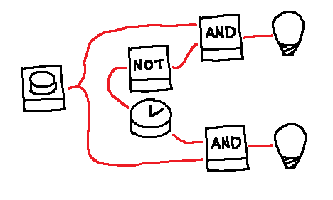

# Coordination is key

## Real World


## World Model
```js
LED {
  id="led-1",
  lit=False,
  input_pin=0,
}

Button {
  id="btn-1",
  pressed=False
  output_pin=0,
}

WireConnection {
  pin_start=InstanceFieldReference("btn-1", "output_pin"),
  pin_end=InstanceFieldReference("led-1", "input_pin"),
}
```

## Interaction
*User*: Turn lower led ON 5 times without turning higher LED ON at all  
*Agent*: understands the temporal, sequential and coordination needed nature of the goal

::: Besides time and sequence understanding, agent must time its actions precisely