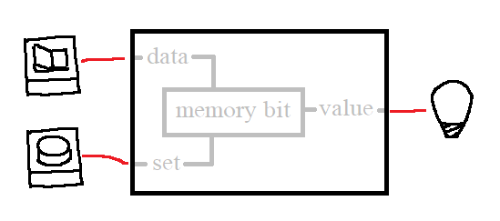

# What's inside?

## Real World


## World Model
```js
LED {
  id="led-1",
  lit=False,
  input_pin=0,
}

Button {
  id="btn-1",
  pressed=False
  output_pin=0,
}

WireConnection {
  pin_start=InstanceFieldReference("btn-1", "output_pin"),
  pin_end=InstanceFieldReference("led-1", "input_pin"),
}
```

## Interaction
*User*: Understand the behaviour of the system  
*Agent*: Goes on an experimental loop about learning

::: Two big things
 - Learning feedback loop so agent learns from testing environment
 - Needs automatic update of WM, used in the point above