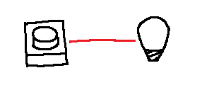

# Weird component's behaviour

## Real World


## World Model
```js
LED {
  id="led-1",
  lit=False,
  input_pin=0,
}

Button {
  id="btn-1",
  pressed=False
  output_pin=0,
}

WireConnection {
  pin_start=InstanceFieldReference("btn-1", "output_pin"),
  pin_end=InstanceFieldReference("led-1", "input_pin"),
}
```

## Interaction
*User*: turn the LED on  
*Agent*: act.interact_with(button,"press")

::: Seems simple but what if you worry about understanding event sequences and timed linked events