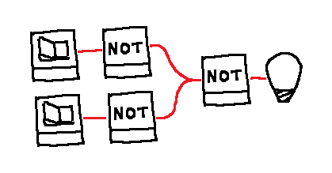

# Solidify your scenarios!

## Real World


## World Model
```js
LED {
  id="led-1",
  lit=False,
  input_pin=0,
}

Button {
  id="btn-1",
  pressed=False
  output_pin=0,
}

WireConnection {
  pin_start=InstanceFieldReference("btn-1", "output_pin"),
  pin_end=InstanceFieldReference("led-1", "input_pin"),
}
```

## Interaction
*User*: turn the LED on  
*Agent*:  
&nbsp;&nbsp;&nbsp;&nbsp;plan loop:  
&nbsp;&nbsp;&nbsp;&nbsp;&nbsp;&nbsp;&nbsp;&nbsp;act.interact_with(switch,"flick") and then...  
&nbsp;&nbsp;&nbsp;&nbsp;&nbsp;&nbsp;&nbsp;&nbsp;act.interact_with(switch,"flick")

::: This mentions sequencial actions planning but that's not the point, the point is, if the agent already knew about AND gate behaviour in it's WM, could or should it be able to abstract the 3 NOT system to an AND in it's WM?