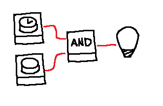

# You'll have to plan this one

## Scenario

## Interaction
*User*: Turn the LED on  
*Agent*: ( presses timed button ), ( presses button )

::: In here the agent needs some temporal and sequential planning