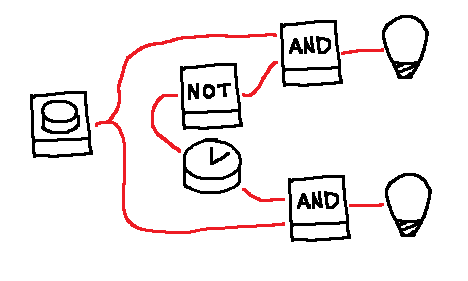

# Coordination is key

## Scenario

## Interaction
*User*: Turn lower led ON 5 times without turning higher LED ON at all  
*Agent*: ( Presses button at exact timing until reaching goal)

::: Besides time and sequence understanding, agent must time its actions precisely