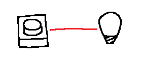

# Weird component's behaviour

## Scenario

## Interaction
*User*: Turn the LED on  
*Agent*: ( Presses button )

::: Seems simple but what if you worry about understanding event sequences and timed linked events