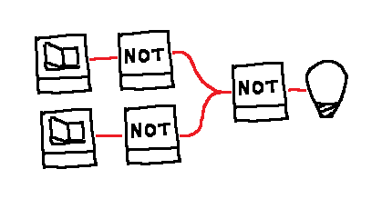

# Solidify your scenarios!

## Scenario

## Interaction
*User*: Turn the LED on  
*Agent*: ( flickes 1st switch), ( flickes 2nd switch )

::: This mentions sequencial actions planning but that's not the point, the point is, if the agent already knew about AND gate behaviour in it's WM, could or should it be able to abstract the 3 NOT system to an AND in it's WM?