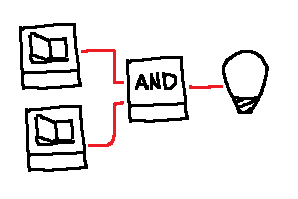

# Now one act isn't enough

## Scenario

## Interaction
*User*: Turn the LED on  
*Agent*: ( flickes 1st switch), ( flickes 2nd switch )

::: Think about act sequentiation, may not need time understanding