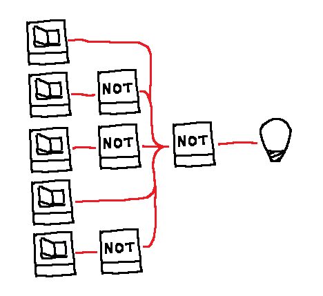

# Password

## Scenario

## Interaction
*User*: Turn the LED on  
*Agent*: ( flickes 1st switch), ( flickes 2nd switch ), ( flickes 3rd switch )  

::: Some bigger sequential examples with more complex reasoning